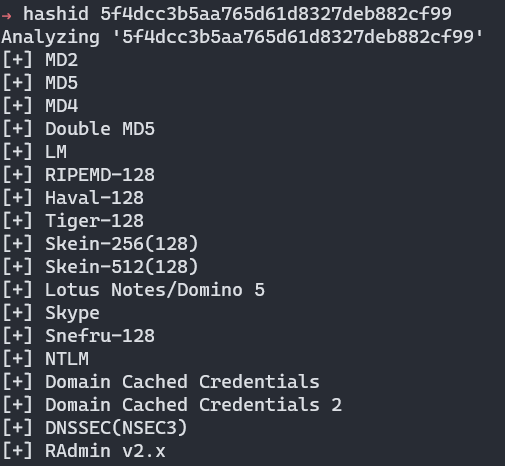

<p align="center">


<p align="center">The Modern Hash Identification System<br>
<code>pip3 install name-that-hash && nth</code>
</p>

<p align="center">   
</p>

<hr>


# 🤔 What is this?


Have you ever come across a hash such as `5f4dcc3b5aa765d61d8327deb882cf99` and wondered what type of hash that is? 🤔

Name-that-hash will name that hash type! 

# 🔥 Features
* 📺 **Popularity Ratings** - Name that hash will show you the most popular hashes first. In older systems it would prioritise [Skype Hash](https://en.wikipedia.org/wiki/Skype_security) the same as [Active Directory's NTLM!](https://docs.microsoft.com/en-us/windows-server/security/kerberos/ntlm-overview) Which makes as much sense as saying that my GitHub is as popular as VSCode 📈
* ✍ **Hash Summaries** - no more wondering whether it's MD5 or NTLM. Name-that-hash will summarise the main usage of each hash, allowing you to make an informed & decisive choice ⚡
* 🌈 **Colour Output** - Don't worry, the colours were hand-selected with a designer to be 100% accessible and gnarly 😎
* 🤖 **JSON output && API** - Want to use Name-That-Hash in your project? We are API first, CLI second. Use JSON output or import us as a Python module! 💾
* 👵 **Updated!** - HashID was last updated in 2015. Hash-Identifier in 2011! Name-That-Hash is a 2021 project 🦧
* ♿ **Accessible** - We are 100% committed to making this an [accessible hacking tool](https://skerritt.blog/a11y/) 🙏
* 🎫 **Extensible** - Add new hashes as quickly as you can edit this README. No, seriously -- it's that easy! 🎱

# 🥊 Name-That-Hash vs HashID vs Hash-Identifier

| **Features** | Name-That-Hash | HashID | Hash-Identifier |
| ---- | ---- | ---- | ---- |
| **Last updated** | 2021, check commits. | 17/03/2015 | 30/09/2011 |

Honestly, do you need any more convincing? 😂

But, let's look at the features more in-depth.

## 📈 Feature Comparison


Here HashID displays Skype before NTLM, whereas Name-That-Hash understands popularity of hashes so places NTLM before Skype.



📕 You can also see Name-That-Hash displaying a summary, whereas HashID doesn't. In the default view it also displays John + HashCat information. Because let's face it, the only reason you're using this tool is to figure out what to put into HashCat! 🐱‍🚀

Name-That-Hash is radically different from HashID, I'm not going to list all the differences -- you can physically see them yourselves 😎

## 💌 Accessibility

Name-That-Hash is an [accessible hacking tool](https://skerritt.blog/a11y/). That means we spent time designing things, such as....


Removing the ASCII Art of very long "least likely" text blocks using `-accessible`.

Doing this means you don't get access to least likely, and if the hash is in that pile it'd suck. So we also have `--no-banner`.


Which removes the ASCII art banner.

# 🔨 Installation

You can install using Python's Pip.

```
pip3 install name-that-hash
```

or:

```
pip install name-that-hash
```

And then run:

```
nth
```

To use.

# 💡 Documentation
Want to learn how popularity works?

What about using this in your own programs?

Or maybe even our commitment to accessibility?

Our documentation is for you!

| 📚 **Documentation** | 🐦 **My Twitter (@ me for questions)** |
| --------------- | ----------------------------------- |
| [Wiki](https://github.com/HashPals/Name-That-Hash/wiki) | [https://twitter.com/bee_sec_san](https://twitter.com/bee_sec_san) |

# 🙏 Contributing

The easiest way to contribute is by adding more hashes, writing descriptions, or changing their REGEX> All you have to do is go to [this file](https://github.com/HashPals/Name-That-Hash/blob/main/name_that_hash/hashes.py) and edit it.

You can read more about [contributing here](https://github.com/HashPals/Name-That-Hash/wiki/Contributing).

# 💌 Thanks

Many thanks to [Jabba](https://github.com/JabbaTheBunny) & Jayyy for their help :)

Thanks to HashID and Hash-Identifier for their work in this field, which heavily inspired this. 💝 The database of hashes was originally taken from them, but we've significantly modified it. Thank you so much for creating that database of 3000+ hashes 😻

Thanks to the TryHackMe Community too, and especially [Oriel](https://twitter.com/OrielOrielOriel) for her feedback on early versions.

And special thanks to Varg on his masterful understanding of colour theory 🌈

Finally, thanks too Blackout for helping write descriptions of hashes 🐱‍👤
